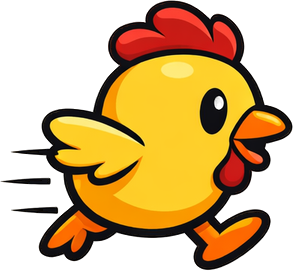

# 🐔 Cluck Rush: The Egg Dash

A fast-paced casual 2D lane runner game built with **Flutter** and **Flame Engine**.



## 🎮 Game Overview

Control a hungry chicken running through the farm! Dodge obstacles, eat food to stay full, and reach the finish line before your hunger meter depletes. Complete levels to lay collectible eggs that hatch into unique chicken skins!

### Core Gameplay
- **Auto-Run:** Your chicken runs automatically to the right
- **3-Lane System:** Swipe up/down to switch lanes
- **Tap to Jump:** Avoid low obstacles like logs and puddles
- **Eat to Survive:** Collect corn (+10% fullness) and worms (+20% fullness)
- **Reach the Goal:** Complete the distance before your hunger meter hits zero!

## 🛠️ Tech Stack

- **Framework:** Flutter 3.10+
- **Game Engine:** Flame 1.34.0
- **Audio:** Flame Audio
- **Storage:** Hive CE (local persistence)
- **Target Platform:** Android (Google Play)

## 📁 Project Structure

```
cluck_rush/
├── lib/
│   ├── main.dart                 # App entry point
│   └── game/
│       └── cluck_rush_game.dart  # Main game class
├── assets/
│   ├── images/                   # Sprite assets
│   ├── audio/                    # Sound effects & music
│   └── font/                     # Lilita One & Rubik fonts
├── documentation/
│   ├── gamegdd.md                # Game Design Document
│   ├── designLanguageSystem.md   # Visual Design Guide
│   └── implementationplan.md     # Development Roadmap
└── pubspec.yaml                  # Dependencies
```

## 🎨 Asset Overview

### Sprites (19 images)

**Player:**
| Asset | Description |
|-------|-------------|
| `chicken_run.png` | Running chicken animation |
| `chicken_jump.png` | Jumping chicken pose |
| `chicken_dizzy.png` | Hit/stunned state |
| `chicken_idle.png` | Idle/menu state |

**Food & Collectibles:**
| Asset | Description |
|-------|-------------|
| `food_corn.png` | Corn collectible (+10%) |
| `food_worm.png` | Worm collectible (+20%) |
| `collectible_egg.png` | Victory reward egg |

**Obstacles & Enemies:**
| Asset | Description |
|-------|-------------|
| `obstacle_hay_bale.png` | Hay bale obstacle |
| `obstacle_rock.png` | Rock obstacle |
| `obstacle_mud_puddle.png` | Mud puddle (slows player) |
| `enemy_fox.png` | Fox enemy |

**Backgrounds (Parallax):**
| Asset | Description |
|-------|-------------|
| `background_sky.png` | Sky with clouds (Layer 1) |
| `background_hills.png` | Farm hills with barn (Layer 2) |
| `background_ground.png` | Dirt road (Layer 3) |
| `background_fence.png` | Farm fence decoration |

**UI Elements:**
| Asset | Description |
|-------|-------------|
| `ui_button_play.png` | Play button |
| `ui_button_pause.png` | Pause button |
| `ui_button_home.png` | Home button |
| `ui_progress_bar_frame.png` | Fullness meter frame |

### Audio
| Asset | Description |
|-------|-------------|
| `mainmenuSong.mp3` | Menu background music |
| `playSong.mp3` | Gameplay background music |
| `chickenCluck.mp3` | Chicken sound effect |
| `eating.mp3` | Food collection sound |
| `Jump.mp3` | Jump sound effect |
| `wrongmove.mp3` | Obstacle hit sound |
| `winLayegg.mp3` | Victory sound |

### Typography
- **Lilita One** - Headlines, buttons, game text
- **Rubik** - Body text, descriptions, UI labels

## 🚀 Getting Started

### Prerequisites
- Flutter SDK 3.10.4 or higher
- Android Studio / VS Code with Flutter extensions
- An Android device or emulator

### Installation

1. Clone the repository:
```bash
git clone https://github.com/yourusername/cluck-rush.git
cd cluck-rush
```

2. Install dependencies:
```bash
flutter pub get
```

3. Run the app:
```bash
flutter run
```

### Build for Release
```bash
flutter build apk --release
```

## 📖 Documentation

Detailed documentation is available in the `/documentation` folder:

- **[Game Design Document](documentation/gamegdd.md)** - Complete game mechanics, UI/UX, and progression system
- **[Design Language System](documentation/designLanguageSystem.md)** - Visual identity, colors, typography, and UI guidelines
- **[Implementation Plan](documentation/implementationplan.md)** - Phase-by-phase development roadmap with code snippets

## 🎯 Development Phases

| Phase | Description | Status |
|-------|-------------|--------|
| Phase 1 | Foundation & Lane Logic | ✅ Complete |
| Phase 2 | Core Mechanics (Player, Parallax, Spawning) | 🟢 Ready to Start |
| Phase 3 | Game Loop (Collision, Win/Lose) | ⏳ Pending |
| Phase 4 | Polish & Juice (UI, Audio, Effects) | ⏳ Pending |
| Phase 5 | Persistent Data (Saves, Collections) | ⏳ Pending |
| Phase 6 | Testing & Release | ⏳ Pending |

**✅ All assets complete!** Ready to implement gameplay.

## 🎨 Design Language

### Color Palette
```
Primary Colors:
- Penny Yellow: #FFD54F (Chicken)
- Farm Green: #8BC34A (Ground)
- Sky Blue: #4FC3F7 (Background)

Functional Colors:
- Success: #66BB6A (Full meter)
- Danger: #EF5350 (Low health)
- Action: #FF7043 (Buttons)

Neutrals:
- Wood Brown: #8D6E63 (UI panels)
- Off-White: #FFF9C4 (Text backgrounds)
- Ink Black: #2C2C2C (Outlines)
```

## 📱 Target Specifications

- **Platform:** Android 5.0+ (API 21+)
- **Orientation:** Portrait only
- **Target Audience:** Casual players, family-friendly (PEGI 3 / Everyone)
- **Monetization:** None (ad-free experience)

## 🤝 Contributing

This is a personal project, but feel free to fork and create your own version!

## 📄 License

This project is for educational/personal use.

---

Made with 🐔 and Flutter
